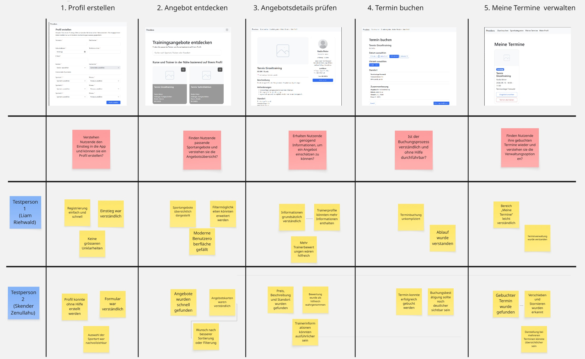

# Projektdokumentation - Proodos App

## Inhaltsverzeichnis

1. [Ausgangslage](#1-ausgangslage)
2. [Lösungsidee](#2-lösungsidee)
3. [Vorgehen & Artefakte](#3-vorgehen--artefakte)
   1. [Understand & Define](#31-understand--define)
   2. [Sketch](#32-sketch)
   3. [Decide](#33-decide)
   4. [Prototype](#34-prototype)
   5. [Validate](#35-validate)
4. [Erweiterungen](#4-erweiterungen)
5. [Projektorganisation](#5-projektorganisation)
6. [KI-Deklaration](#6-ki-deklaration)
7. [Anhang](#7-anhang)

> **Hinweis:** Massgeblich sind die im **Unterricht** und auf **Moodle** kommunizierten Anforderungen.

<!-- WICHTIG: DIE KAPITELSTRUKTUR DARF NICHT VERÄNDERT WERDEN! -->

## 1. Ausgangslage

**Problem:**

Die Gewinnung neuer Kundschaft stellt für Sporttrainer/-innen eine grosse Herausforderung dar. Viele Trainer sind nicht technisch affin und haben Schwierigkeiten, potenzielle Kundinnen und Kunden über digitale Kanäle zu erreichen. Häufig erfolgt die Kundengewinnung über persönliche Empfehlungen oder traditionelle Werbemittel wie Webseiten oder Zeitungsanzeigen.

Zudem ist die Kommunikation zwischen Trainern und Kunden fragmentiert, da verschiedene Kommunikationskanäle wie Telefon oder E-Mail genutzt werden. Dies führt zu ineffizienten und langsamen Abstimmungsprozessen.

Auch die Organisation von Terminen ist für viele Trainer schwierig, da sie flexible Arbeitszeiten haben und oft keinen zentralen Überblick über ihre Termine und Trainingsorte besitzen.

Auf Kundenseite bestehen ebenfalls mehrere Probleme: Teilzeitsportler bis Profisportler haben Schwierigkeiten, passende Sporttrainer zu finden. Es fehlt an zentralen Plattformen, auf denen Trainer nach Standort, Sportart und Verfügbarkeit gesucht werden können. Zudem sind Bewertungen und Feedback oft nicht vorhanden oder wenig vertrauenswürdig. Der Buchungsprozess ist häufig umständlich und zeitaufwendig.

**Beispiel:**

Sarah (21) aus Zürich spielt gerne am Wochenende Tennis und möchte ihre Fähigkeiten verbessern. Sie sucht nach einem Tennistrainer in ihrer Nähe, findet jedoch keinen geeigneten Trainer. Zudem kann sie nicht einsehen, ob ein Trainer zu ihren gewünschten Zeiten verfügbar ist. Bewertungen fehlen oder wirken nicht authentisch. Obwohl sich ein Tennisplatz in ihrer Nähe befindet, sind viele Trainer nicht bereit, dort Trainingseinheiten durchzuführen.

**Ziele:**

- Verbesserung der Auffindbarkeit von Sporttrainern für unterschiedliche Sportarten und Leistungsniveaus
- Vereinfachung und Beschleunigung des Buchungsprozesses zwischen Sportlern und Trainern
- Reduktion von Kommunikationshürden zwischen Trainern und Kunden
- Erhöhung der Transparenz durch Bewertungen und Feedback zu Trainern
- Bessere Planbarkeit und Übersicht von Trainings, Terminen und Trainingsorten
- Unterstützung von Sporttrainern bei der Gewinnung neuer Kundschaft

**Primäre Zielgruppe:**

Die primäre Zielgruppe von Proodos sind sportinteressierte junge Erwachsene und Erwachsene im Alter von ca. 18 bis 35 Jahren, die flexibel und standortbasiert ein passendes Sporttraining buchen möchten. Dazu gehören vor allem Personen, die ihre Fitness verbessern, eine neue Sportart ausprobieren oder gezielt mit einem Trainer an ihrer Technik arbeiten möchten.

Typische Nutzerinnen und Nutzer sind Studierende, Berufseinsteiger und aktive Freizeit- oder Hobbysportler, die einfache Buchungsprozesse, transparente Angebote und passende Trainings in ihrer Nähe erwarten.

**Sekundäre Zielgruppe:**

- Sporttrainerinnen und Sporttrainer, die ihre Trainingsangebote sichtbar machen und neue Kundinnen und Kunden gewinnen möchten.
- Fortgeschrittene Sportlerinnen und Sportler, die gezielt nach Techniktraining, Leistungsverbesserung oder spezialisierten Trainings suchen.

**Weitere Stakeholder:**

- Sportvereine
- Sporttrainer-Verbände
- Gewerkschaften und Organisationen im Sportbereich

## 2. Lösungsidee

Die Lösung ist eine digitale Plattform als Web-App, die Sportler/-innen schnell und unkompliziert mit passenden Sporttrainer/-innen verbindet. Nutzer können ein Profil erstellen, ihre Sportarten und Ziele definieren und anschliessend gezielt nach qualifizierten Trainern in ihrer Nähe suchen. Durch Filterfunktionen, Bewertungen und personalisierte Vorschläge wird die Auswahl vereinfacht.

Trainingseinheiten können flexibel und kurzfristig gebucht sowie über eine Terminübersicht verwaltet werden. Ein Bewertungssystem schafft zusätzlich Vertrauen und Transparenz.

**Kernfunktionalität:**

- Profilerstellung als Onboarding-Formular
- Login für den Prototyp
- Profilansicht und Profilbearbeitung
- Suche nach Sporttrainer/-innen und Trainingsangeboten
- Empfehlungen auf Basis von Sportart, Niveau und Region
- Buchungsportal für verfügbare Termine
- Terminübersicht unter „Meine Termine“
- Möglichkeit, gebuchte Termine zu stornieren oder zu verschieben
- Benachrichtigungen zu Buchung, Verschiebung und Stornierung
- Bewertungsansicht für Trainingsangebote

**Workflow:**

1. Der User öffnet die App und erstellt ein Profil mit Personalien und Interessen.
2. Das System speichert die Profildaten und die ausgewählten Sportarten.
3. Die App zeigt auf der Hauptseite passende Trainingsangebote an.
4. Der User kann nach Angeboten suchen oder eine Sportkategorie auswählen.
5. Der User öffnet die Detailansicht eines Angebots.
6. Das System zeigt die verfügbaren Termine des Trainers an.
7. Der User wählt eine verfügbare Trainingsstunde aus.
8. Das System prüft, ob der Termin noch verfügbar ist.
9. Die Buchung wird gespeichert.
10. Der User erhält eine Bestätigungsseite mit Buchungs-ID.
11. Der gebuchte Termin wird im Bereich „Meine Termine“ angezeigt.
12. Der User erhält eine Benachrichtigung zur Buchung.
13. Der User kann einen Termin bei Bedarf stornieren oder verschieben.

**Abgrenzung:**

**Login und Anmeldung:**

Im Prototyp wird kein vollständiger Registrierungsprozess per E-Mail umgesetzt. Stattdessen wird ein vereinfachter Dummy-Login verwendet und eine User-ID in einem Cookie gespeichert. Dadurch kann der Prototyp den aktuellen User simulieren.

**Zahlungsportal:**

Die Implementierung eines Zahlungsprozesses, z. B. via TWINT oder Kreditkarte, ist nicht Teil des Mindestumfangs.

**Trainerbereich:**

Ein eigener Trainerbereich zur Verwaltung von Angeboten, Verfügbarkeiten und Buchungsanfragen wurde im aktuellen Prototyp nicht umgesetzt.

**Trainerbestätigung:**

Eine manuelle Bestätigung von Buchungsanfragen durch Trainer wurde nicht umgesetzt. Im Prototyp werden Buchungen direkt bestätigt.

**Admin:**

Ein Admin Bereich zur Verwaltung von Angeboten, User und Buchungen wurde im aktuellen Prototyp nicht umgesetzt.

## 3. Vorgehen & Artefakte

Die Durchführung erfolgte phasenbasiert. Die wichtigsten Ergebnisse je Phase sind in den folgenden Abschnitten dokumentiert.

### 3.1 Understand & Define

**Zielgruppenverständnis:**

Die Zielgruppen wurden in vier Gruppen unterteilt.

**Teilzeitsportler/-innen**

- **Alter:** 18 bis 55 Jahre
- **Demografie:** Erwachsene, Studierende und Eltern
- **Beschreibung:** Teilzeitsportler/-innen treiben unregelmässig Sport, ungefähr ein- bis zweimal pro Woche. Studierende und Erwachsene mit Kindern haben oft unregelmässige Terminpläne. Für sie ist es wichtig, Trainingseinheiten einfach und schnell mit Sporttrainern abzuklären.
- **Probleme:**
  - Wenig oder keine Erfahrung in bestimmten Sportarten
  - Wenig Zeit, passende Sporttrainer zu suchen
  - Keine bisherigen Erfahrungen mit Sporttrainern
  - Fehlende Bewertungen oder Nachweise von Fortschritten anderer Kunden
- **Ziele:**
  - Flexible Trainingseinheiten nach Zeit und Standort buchen
  - Keine langfristigen Trainingsverträge eingehen
  - Sporttrainer auf Basis der eigenen Bedürfnisse vorgeschlagen bekommen
  - Authentische Bewertungen einsehen
- **Persona:** Luka (21), Student, hat nicht immer Zeit, regelmässig ins Fitnessstudio zu gehen, möchte aber Fortschritte machen. Er hat keine Zeit, einen passenden Fitnesstrainer zu finden, und findet keine authentischen Bewertungen.
- **Typische Sportarten:** Fitness, Gym usw.

**Hobbysportler/-innen**

- **Alter:** 18 bis 45 Jahre
- **Demografie:** Erwachsene, junge Erwachsene und Studierende
- **Beschreibung:** Hobbysportler/-innen treiben regelmässig Sport, ungefähr zwei- bis dreimal pro Woche, und möchten ihre Leistung verbessern. Sie sind offen für Unterstützung durch Trainer.
- **Probleme:**
  - Wenig Zeit, passende Sporttrainer zu suchen
  - Keine bisherigen Erfahrungen mit Sporttrainern
  - Fehlende Bewertungen oder Nachweise von Fortschritten anderer Kunden
  - Schwierigkeit, einen Trainer für das passende Leistungsniveau zu finden
- **Ziele:**
  - Flexible Trainingseinheiten nach Zeit und Standort buchen
  - Trainer auf Basis der eigenen Bedürfnisse vorgeschlagen bekommen
  - Authentische Bewertungen einsehen
- **Persona:** Victoria (30), arbeitet im Sales und sucht seit einigen Wochen nach einer passenden Tennistrainerin. Sie findet jedoch keine Trainerin, die zu ihrem Niveau passt und zeitlich flexibel ist.
- **Typische Sportarten:** Gym, Fitness, Yoga, Tennis usw.

**Leidenschaftliche Sportler/-innen**

- **Alter:** 16 bis 35 Jahre
- **Demografie:** Erwachsene, junge Erwachsene und Studierende
- **Beschreibung:** Diese Zielgruppe ist sehr aktiv und trainiert ungefähr vier- bis fünfmal pro Woche. Sie arbeitet gezielt an der eigenen Leistungssteigerung und ist stark auf professionelle Unterstützung angewiesen.
- **Probleme:**
  - Keine passenden Sporttrainer für das eigene Niveau
  - Fehlende Einsicht in authentische Bewertungen
  - Fehlende zeitliche Flexibilität
- **Ziele:**
  - Flexible Trainingseinheiten nach Zeit und Standort buchen
  - Authentische Bewertungen einsehen
  - Direkte Leistungssteigerung durch qualitative Sporttrainer
- **Persona:** Yannick (24) läuft seit mehreren Jahren Marathon und trainiert regelmässig. Er möchte sich für seinen nächsten Marathon vorbereiten, hat aber keine Erfahrung mit Profitrainern und weiss nicht, wo er passende Unterstützung findet.
- **Typische Sportarten:** Marathon, Bergsteigen usw.

**Profisportler/-innen**

- **Alter:** 18 bis 40 Jahre
- **Demografie:** Junge Erwachsene und Erwachsene
- **Beschreibung:** Profisportler/-innen trainieren mehrmals pro Woche und sind stark auf die Expertise von professionellen Trainern angewiesen. Der sportliche Erfolg hat direkten Einfluss auf ihre Karriere.
- **Probleme:**
  - Schnelle Findung von Profitrainern für die richtige Sportart
  - Schwierigkeit, qualifizierte Trainer schnell zu erkennen
  - Kurzfristige Verfügbarkeit
  - Ortsunabhängigkeit
- **Ziele:**
  - Profitrainer kurzfristig buchen
  - Schnelle und einfache Buchung von Trainingseinheiten
  - Qualifizierte Trainer nach Region finden
- **Persona:** Linda (28) ist professionelle Skispringerin. Um konkurrenzfähig zu bleiben, absolviert sie regelmässig Krafttraining. Während eines Aufenthalts bei ihren Eltern in der Westschweiz sucht sie einen qualifizierten Krafttrainer, der sie auf Basis ihres Trainingsrapports unterstützen kann.
- **Typische Sportarten:** Skispringen, Tennis, Ski Alpin, Fussball usw.

**Wesentliche Erkenntnisse:**

- Vertrauen in Trainer ist ohne Bewertungen oder Referenzen gering.
- Authentische Bewertungen und Fortschrittsnachweise sind sehr wichtig.
- Zeitmangel ist ein zentrales Problem bei allen Zielgruppen.
- Flexibilität bei Zeit und Ort ist für viele Nutzer entscheidend.
- Standortunabhängigkeit gewinnt an Bedeutung.
- Qualität und Spezialisierung der Trainer werden immer wichtiger.
- Es besteht ein Wunsch nach personalisierter Trainervermittlung.

### 3.2 Sketch

**Variantenüberblick:**

In der Sketch-Phase wurden mehrere Varianten für den Aufbau der App und den Hauptworkflow skizziert.

Skizze 1 (Crazy 8's)

Skizze 2 (Skizze inkl. Workflow)

**Skizzen:**

In der ersten Skizze wurden mehrere wichtige Funktionen einbezogen. Im Gruppencoaching konnte besonders die Terminansicht und die Möglichkeit, Termine des Trainers einzusehen, aufgegriffen werden.

In der zweiten Skizze inkl. Workflow wurde zusätzlich die Benachrichtigungsfunktion skizziert. Eine vollumfängliche Nachrichtenfunktion wurde später entfernt, da sie für den Mindestumfang zu umfangreich gewesen wäre. Stattdessen wurden einfache System-Benachrichtigungen umgesetzt.

### 3.3 Decide

**Gewählte Variante & Begründung:**

Nach dem Input im Gruppencoaching wurde entschieden, die Nachrichtenfunktion wegzulassen. Stattdessen liegt der Fokus auf Profilerstellung, Angebotsanzeige, Detailansicht, Terminbuchung und Terminverwaltung. Diese Funktionen bilden den Kernnutzen der App am besten ab.

Die Entscheidung gegen eine vollumfängliche Nachrichtenfunktion wurde getroffen, weil diese den Rahmen des Prototyps sprengen würde. Der Fokus sollte auf den Funktionen liegen, die den Mehrwert der App direkt zeigen.

Eine Kartenansicht wurde als sinnvolle Erweiterung identifiziert. Sie verbessert die Suche nach Angeboten in der Nähe und erhöht die Benutzerfreundlichkeit.

**Use-Case-Diagramm**

Das Use-Case-Diagramm zeigt die wichtigsten Funktionen der Anwendung und die beteiligten Rollen. Im Mindestumfang liegt der Fokus auf dem User, der ein Profil erstellt, Angebote durchsucht und Termine bucht. Trainer- und Admin Bereiche werden nicht umgesetzt aber sind bei der nächsten Stufe der Entwicklung der App umgesetzt werden. (Nicht im Prototyp)

**End-to-End-Ablauf:**

1. Der User erstellt ein Profil mit Personalien und Interessen.
2. Das System speichert die Profildaten und die ausgewählten Sportarten.
3. Die App zeigt auf der Hauptseite passende Trainingsangebote an.
4. Das System zeigt die verfügbaren Termine des Trainers an.
5. Der User wählt eine verfügbare Trainingsstunde aus.
6. Das System prüft die Verfügbarkeit des Termins.
7. Die Buchung wird im System gespeichert.
8. Der User erhält eine Bestätigungsseite.
9. Der gebuchte Termin wird im Bereich „Meine Termine“ angezeigt.
10. Der User kann den Termin bei Bedarf stornieren oder verschieben.

**User Journey Map:**

Die User Journey Map zeigt den Ablauf aus Sicht des Users vom Einstieg bis zur Buchung.

**Mockup:**

https://www.figma.com/proto/WeAMfqd8XFX7e8SgEoxRPi/Proodos-Web-App

Im Mockup werden auf der Hauptseite Trainingsangebote in der Nähe der Gemeinde des Users angezeigt. Der User kann nach Sportarten, Trainern oder Standorten suchen. Zusätzlich sind Filter vorgesehen, zum Beispiel nach Niveau oder Mindestbewertung.

In der Profilansicht sieht der User seine eigenen Profildaten. Auf Basis der interessierten Sportarten werden passende Trainer und Angebote vorgeschlagen.

Unter „Meine Termine“ kann der User seine gebuchten Termine ansehen und stornieren.

**Screenshots**

Hauptseite

Angebot Detailansicht

Bewertungen

Termin Auswahl Ansicht

Meine Termine:

### 3.4 Prototype

#### 3.4.1. Entwurf (Design)

**Informationsarchitektur:**

**Navigationsleiste:**

Nach der Profilerstellung hat der User über die Navigation Zugriff auf die Hauptseite „Angebote“, „Sportkategorien“, „Karte“, „Meine Termine“.
Der Profil-Avatar hat ein Dropdwon bei der der User auf die Seite "Benachrichtigungen", "Mein Profil" und "Info" zugreifen kann.

**Startseite:**

Auf der Startseite wird der User mit einem Intro Text begrüsst und aufgefordert, ein Profil zu erstellen oder sich einzuloggen.

**Hauptseite:**

Die Hauptseite zeigt dem User Trainingsangebote, die seinem Profil entsprechen. Die Angebotskarten zeigen Preis, Standort, Niveau und den Namen des Trainers.

**Detailansicht Trainingsangebot:**

Auf dieser Seite werden weitere Informationen zum Kurs angezeigt, zum Beispiel Beschreibung, Anforderungen und Standort. Zusätzlich werden Informationen zum Trainer dargestellt, beispielsweise Erfahrung und Zertifikate.

**Meine Termine:**

Die Termine werden wie auf der Hauptseite in Karten dargestellt. Die Karten enthalten die wichtigsten Informationen zum Termin. Zusätzlich kann ein Termin verwaltet, verschoben oder storniert werden.

**Mein Profil:**
Auf der Seite mein Profil kann der User sein Profil alle seine Logindaten sehen. Interresierte Sportarten und den Zieltext sieht er ebenfalls auf der Seite.

**Karte (Erweiterung):**

Die Kartenansicht zeigt Trainingsstandorte von vorgeschlagenen Angeboten mit Ihrem Standort im Kanton des Users. Nach belibigen Angeboten kann gesucht und gefiltert werden in der Ansicht oder in der Karte direkt angewählt werden. Die rechte Ergebnisliste zeigt passende Angebote und kann nach Relevanz, Standort, Bewertung, Preis oder nächstem Termin sortiert werden.

**Benachrichtigungen (Erweiterung):**

Die Benachrichtigungsseite zeigt Systemmeldungen zu Buchungen, Verschiebungen und Stornierungen. Die Nachrichten enthalten u. a. Angebot, Buchungsnummer und Datum.

**User Interface Design:**

**Suchfunktion:**

Die Suchfunktion kann auf der Hauptseite und in der Karte genutzt werden und ermöglicht dem User, nach Sportarten, Trainern oder Standorten zu suchen.

**Profilerstellung:**

Die Profilerstellung ist als standardmässiges Formular umgesetzt. Der User wird mit einer roten „\*“-Markierung auf Pflichtfelder hingewiesen. Zusätzlich wird ein Hinweis angezeigt, dass im Prototyp keine echten Personendaten eingegeben werden sollen.

**Profil:**

In der Profilansicht sieht der User alle relevanten Informationen seines erstellten Profils. Er kann seine Profildaten bearbeiten oder sein Profil löschen.

**Terminauswahl:**

Die Terminauswahl ist in zwei Schritte aufgeteilt. Der User wählt zuerst einen verfügbaren Tag und danach eine passende Uhrzeit. Zusätzlich werden der Standort und eine Zusammenfassung der Buchung angezeigt.

**Designentscheidungen:**

**Terminauswahl:**

Im Mockup war ursprünglich eine Kalenderansicht geplant. Diese Umsetzung wäre technisch aufwändiger gewesen. Deshalb wurde für den Prototyp eine einfachere Lösung mit der Bootstap Kalenderauswahl und Uhrzeit-Buttons umgesetzt.

**Profil:**

Das Profil kann im Prototyp bearbeitet werden. Standort, Gemeinde und interessierte Sportarten haben Einfluss auf die angezeigten Angebote und die Kartenansicht.

**Bewertungen:**

Die Implementierung einer Bewertungsansicht wie beim Mockup war nicht möglich. Alternativ musste das Design aufgebaut werden auf einem einfachen minimalistischen Design.

**Kartenansicht:**

Die Kartenansicht wurde mit Leaflet und OpenStreetMap umgesetzt. Dadurch können Trainingsstandorte geografisch dargestellt werden.

#### 3.4.2. Umsetzung (Technik)

**Technologie-Stack:**

Die App wurde mit SvelteKit umgesetzt. Für die Gestaltung wird Bootstrap verwendet. Die Daten werden in MongoDB gespeichert. Für die Karte wird Leaflet mit OpenStreetMap genutzt. Die Anwendung ist als Web-App aufgebaut und soll auf Desktop, Tablet und Mobile nutzbar sein.

**Tooling:**

Die Entwicklung erfolgte lokal in Visual Studio Code. Für die Datenbank wurde MongoDB Atlas bzw. MongoDB Compass verwendet. Für das Deployment wurde Netlify eingesetzt.

**Struktur & Komponenten:**

**Routen (Seiten):**

**Startseite (`/`):**

Die Startseite ist der Einstiegspunkt der Anwendung. Der User kann sich einloggen oder ein Profil erstellen.

**Create-profil (`/create-profil`):**

Auf dieser Seite füllt der User ein Formular zur Profilerstellung aus. Die eingegebenen Daten werden serverseitig verarbeitet und in MongoDB gespeichert.

**Login (`/login`):**

Für den Prototyp wurde ein Dummy-Login umgesetzt. Dadurch kann ein bestehender User simuliert werden.

**Profil (`/profil`):**

Auf dieser Seite sieht der User seine gespeicherten Informationen. Zusätzlich können die Profildaten bearbeitet und das Konto gelöscht werden.

**Offers (`/offers`):**

Die Offers-Seite ist die Hauptseite der Anwendung. Dort werden Trainingsangebote angezeigt, die zum Profil des Users passen. Die Sortierung basiert auf Sportarten, Niveau und Region.

**Sportkategorien (`/categories`):**

Die Sportarten werden aus einer zentralen Datei geladen und alphabetisch dargestellt. Jede Sportart erhält ein passendes Bild bzw. Piktogramm.

**Detailansicht (`/offers/[id]`):**

Die Detailansicht zeigt alle wichtigen Informationen zu einem einzelnen Trainingsangebot. Dazu gehören Beschreibung, Anforderungen, Preis, Niveau, Standort, Bewertung und Informationen zum Trainer.

**Booking (`/booking/[offerId]`):**

Die Buchungsseite zeigt verfügbare Termine eines Trainingsangebots. Bereits gebuchte Termine werden nicht mehr als auswählbare Option angezeigt. Zusätzlich kann ein Wunschstandort angegeben werden.

**Buchungsbestätigung (`/booking/success`):**

Nach erfolgreicher Buchung gelangt der User auf die Bestätigungsseite. Dort werden das gebuchte Angebot, der Trainer, der Termin und die Buchungs-ID angezeigt.

**Appointments (`/appointments`):**

Auf dieser Seite sieht der User seine gebuchten Termine. Einzelne Termine können storniert, verschoben oder bei Wiederholungsbuchungen als Teil einer Serie verwaltet werden.

**Map (`/map`):**

Die Kartenansicht zeigt Trainingsstandorte. Marker können ausgewählt werden und öffnen das zugehörige Angebot in der Ergebnisliste.

**Notifications (`/notifications`):**

Die Benachrichtigungsseite zeigt Systemmeldungen zu Buchungen, Verschiebungen und Stornierungen.

**Startseite (`/info`):**

Alle Information zum Prototyp bezüglich Funktionen, Datenschutz befinden sich auf dieser Seite.

**Komponenten:**

**ProfileCard und ProfileForm:**
`my-app/src/lib/components/profile/ProfileCard.svelte`
`my-app/src/lib/components/profile/ProfileForm.svelte`

Das ProfileForm zeigt das Registierungsformular. Die ProfileCard zeigt die Profildaten unter "Mein Profil"

**OfferCard:**

`my-app/src/lib/components/offers/OfferCard.svelte`

Die OfferCard zeigt ein einzelnes Trainingsangebot als Karte an. Sie enthält die wichtigsten Informationen für die erste Auswahl.

**OfferList:**

`my-app/src/lib/components/offers/OfferList.svelte`

Die OfferList zeigt mehrere Angebote in einem Bootstrap-Grid-System an.

**OfferDetail:**

`my-app/src/lib/components/offers/OfferDetail.svelte`

Die Komponente strukturiert die Detailansicht eines Angebots.

**SearchBar:**

`my-app/src/lib/components/search bar/SearchBar.svelte`

Die SearchBar ermöglicht eine Suche über Sportarten, Trainer, Standort, Gemeinde, Kanton, Niveau, Datum, Preis und Bewertung.

**LeafletMap:**

`my-app/src/lib/components/map/LeafletMap.svelte`

LeafletMap zeigt Angebote auf einer interaktiven Karte an.

**BookingSummary und BookingConfirmation:**

`my-app/src/lib/components/booking/BookingSummary.svelte`  
`my-app/src/lib/components/booking/BookingConfirmation.svelte`

BookingSummary fasst vor dem Absenden der Buchung die wichtigsten Angaben zusammen. BookingConfirmation wird nach erfolgreicher Buchung verwendet.

**AppointmentCard und AppointmentList:**

`my-app/src/lib/components/appointments/AppointmentCard.svelte`  
`my-app/src/lib/components/appointments/AppointmentList.svelte`

AppointmentList zeigt alle gebuchten Termine des Users an. AppointmentCard stellt einen einzelnen Termin als Karte dar und enthält Verwaltungsfunktionen.

**Daten & Schnittstellen:**

Die Daten der Proodos App werden in MongoDB gespeichert und verwaltet. Die Schnittstelle zwischen der SvelteKit-Anwendung und der Datenbank erfolgt über die Datei `my-app/src/lib/db.js`. In dieser Datei befinden sich die wichtigsten asynchronen Funktionen für den Datenzugriff.

Die eigentliche Verarbeitung findet in den jeweiligen `+page.server.js` Dateien statt. Diese Dateien rufen die Funktionen aus `db.js` auf und geben die geladenen Daten an die passenden `+page.svelte` Seiten weiter.

**Datenstruktur:**

Die Daten werden in MongoDB in verschiedenen Collections gespeichert. Für den Prototyp sind vor allem folgende Collections relevant:

- `users`
- `trainingOffers`
- `trainingLocations`
- `bookings`
- `reviews`
- `notifications`
- `favorites`

**Mockdaten:**

Die Mockdaten dienen dazu, den Prototyp mit realistischen Beispieldaten zu testen. Die Mockdaten enthalten User, Trainer, Trainingsangebote, Standorte, Bewertungen und Termine.

Ordner: `json_mockdata`

**Wichtige Metadaten zu den Mockdaten:**

- Users (customers and trainers)
- Training Locations
- Training Offers
- Buchungen (Nicht wichtig für diesen Prototyp)
- Bewertungen
- Benachrichtigungen
- Favoriten

**Speicherung eines neuen Profils:**

Datei: `my-app/src/routes/create-profil/+page.server.js`

Für die Speicherung eines neuen Profils wird eine serverseitige `action` verwendet. Die eingegebenen Formularwerte werden über `request.formData()` ausgelesen und zu einem neuen User-Objekt zusammengesetzt. Dieses Objekt wird anschliessend mit der Funktion `createUser()` in MongoDB gespeichert.

**Laden der Angebote anhand des Profils:**

Datei: `my-app/src/routes/offers/+page.server.js`

Auf der Offers-Seite werden zuerst der aktive User und alle Trainingsangebote aus der Datenbank geladen. Danach werden die Angebote mit den Interessen und dem Standort des Users verglichen.

**Terminauswahl und Speicherung der Buchung:**

Datei: `my-app/src/routes/booking/[offerId]/+page.server.js`

Bei der Buchung lädt der Server das ausgewählte Angebot und die bereits bestehenden Buchungen für dieses Angebot. Dadurch kann geprüft werden, welche Termine noch verfügbar sind. Die Buchung wird anschliessend in MongoDB gespeichert und erhält eine Buchungsnummer.

**Meine Termine:**

Datei: `my-app/src/routes/appointments/+page.server.js`

Die Seite „Meine Termine“ lädt alle Buchungen des aktiven Users. Zusätzlich können Termine storniert oder verschoben werden.

**Deployment:**

https://proodoscoaching.netlify.app/

**Besondere Entscheidungen:**

- Die App verwendet im Prototyp kein echtes Login, sondern ein vereinfachtes Dummy-Login.
- Buchungen werden direkt bestätigt.
- Bereits gebuchte Termine werden bei der Buchung nicht mehr als auswählbare Option angezeigt.
- Eine vollständige Kalenderansicht bei der Auswahl eines Termins wurde zugunsten einer einfacheren Datum- und Uhrzeitauswahl nicht umgesetzt.
- Bilder werden nicht in MongoDB gespeichert, sondern über Helper-Funktionen anhand der Sportart bzw. des Trainerprofils geladen.

### 3.5 Validate

#### URL der getesteten Version

Getestete Version:  
https://6a0304abf89ffc0008520935--proodoscoaching.netlify.app/

Version: 0.5  
Datum: 20.05.2026

#### Ziele der Prüfung

Mit der Evaluation wurde geprüft, ob der zentrale Ablauf von Proodos verständlich ist:

- Profil erstellen
- passende Trainingsangebote finden
- Detailansicht verstehen
- Termin buchen
- gebuchte Termine unter „Meine Termine“ finden und verwalten
- Unklarheiten und Verbesserungsideen erkennen

#### Vorgehen

Die Evaluation wurde als moderierter Usability-Test vor Ort durchgeführt. Die Testpersonen erhielten ein realistisches Szenario und bearbeiteten mehrere Aufgaben im Prototyp. Währenddessen wurden Beobachtungen, Probleme und Rückmeldungen notiert.

#### Stichprobe

<table>
  <tr>
    <th>Testperson</th>
    <th>Profil</th>
    <th>Testart</th>
  </tr>
  <tr>
    <td>Liam Reihwald</td>
    <td>Student, Freizeitsportler</td>
    <td>1 Usability-Test</td>
  </tr>
  <tr>
    <td>Skender Zenullahu</td>
    <td>Student, Sportinteressiert</td>
    <td>1 Usability-Test</td>
  </tr>
</table>

#### Aufgaben / Szenarien

**Ausgangslage:**  
Die Testperson ist Student und Freizeitsportler und möchte im Krafttraining Fortschritte machen. Dafür sucht sie über Proodos einen passenden Trainer und möchte flexibel einen Termin buchen.

**Aufgabe 1:**  
Ein Profil erstellen, damit passende Sportangebote angezeigt werden.

**Aufgabe 2:**  
Ein passendes Trainingsangebot suchen und die Detailansicht prüfen.

**Aufgabe 3:**  
Einen Termin buchen und diesen anschliessend unter „Meine Termine“ verwalten.

#### Kennzahlen & Beobachtungen

<table>
  <tr>
    <th>Aufgabe</th>
    <th>Erfolgsquote</th>
    <th>Beobachtung</th>
  </tr>
  <tr>
    <td>Profil erstellen</td>
    <td>2/2</td>
    <td>Die Registrierung wurde als einfach und schnell wahrgenommen.</td>
  </tr>
  <tr>
    <td>Angebot finden</td>
    <td>2/2</td>
    <td>Die Darstellung der Sportangebote war übersichtlich und verständlich.</td>
  </tr>
  <tr>
    <td>Detailansicht prüfen</td>
    <td>2/2</td>
    <td>Die wichtigsten Informationen zum Angebot wurden gefunden. Trainerprofile könnten jedoch mehr Informationen enthalten.</td>
  </tr>
  <tr>
    <td>Termin buchen</td>
    <td>2/2</td>
    <td>Die Terminbuchung war unkompliziert.</td>
  </tr>
  <tr>
    <td>Termin verwalten</td>
    <td>2/2</td>
    <td>Der Bereich „Meine Termine“ war leicht verständlich. Verschieben und Stornieren wurden gefunden.</td>
  </tr>
</table>

**Positive Rückmeldungen:**

- Einfache und schnelle Registrierung
- Übersichtliche Darstellung der Sportangebote
- Moderne Benutzeroberfläche
- Unkomplizierte Terminbuchung
- Bereich „Meine Termine“ ist leicht verständlich

**Probleme / Unklarheiten:**

- Trainerprofile könnten mehr Informationen enthalten.
- Filtermöglichkeiten könnten erweitert werden.
- Mehr Trainerbewertungen wären hilfreich.
- Bei mehreren Angeboten wäre eine bessere Eingrenzung der Suche sinnvoll.

**Neue Ideen / Anforderungen aus dem Test:**

- Favoritenfunktion für interessante Trainer oder Angebote
- Mehr Trainerbewertungen anzeigen
- Erweiterte Filter nach Sportart, Niveau, Preis oder Bewertung
- Trainerprofile mit mehr Informationen ergänzen

#### Zusammenfassung der Resultate

Die Evaluation zeigte, dass der zentrale Ablauf von Proodos grundsätzlich funktioniert. Beide Testpersonen konnten ein Profil erstellen, Angebote finden, einen Termin buchen und diesen unter „Meine Termine“ verwalten. Positiv bewertet wurden vor allem die einfache Registrierung, die moderne Oberfläche, die übersichtliche Darstellung der Angebote und die unkomplizierte Terminbuchung. Verbesserungsbedarf besteht vor allem bei ausführlicheren Trainerprofilen, erweiterten Filtermöglichkeiten und mehr sichtbaren Bewertungen.

#### Abgeleitete Verbesserungen

<table>
  <tr>
    <th>Priorität</th>
    <th>Verbesserung</th>
    <th>Begründung</th>
  </tr>
  <tr>
    <td>Hoch</td>
    <td>Trainerprofile erweitern</td>
    <td>Testfeedback zeigte, dass mehr Informationen zu Trainern hilfreich wären.</td>
  </tr>
  <tr>
    <td>Hoch</td>
    <td>Filtermöglichkeiten erweitern</td>
    <td>Nutzende möchten Angebote gezielter nach Sportart, Niveau, Preis oder Bewertung eingrenzen.</td>
  </tr>
  <tr>
    <td>Mittel</td>
    <td>Mehr Trainerbewertungen anzeigen</td>
    <td>Bewertungen helfen dabei, Vertrauen in ein Angebot aufzubauen.</td>
  </tr>
  <tr>
    <td>Mittel</td>
    <td>Favoritenfunktion ergänzen</td>
    <td>Interessante Angebote oder Trainer sollen einfacher wiedergefunden werden.</td>
  </tr>
  <tr>
    <td>Tief</td>
    <td>Darstellung der Angebotskarten weiter optimieren</td>
    <td>Die Karten waren verständlich, könnten bei vielen Informationen aber noch übersichtlicher gestaltet werden.</td>
  </tr>
</table>

Ein Teil dieser Erkenntnisse wurde später im Prototyp weitergedacht oder umgesetzt, zum Beispiel durch zusätzliche Funktionen zur besseren Verwaltung und Orientierung. Diese späteren Erweiterungen werden im Kapitel Prototype bzw. in der Beschreibung der umgesetzten Funktionen dokumentiert.

#### Issue Map

Zur Auswertung der Usability-Tests wurde eine Issue Map erstellt. Darin wurden die wichtigsten Arbeitsschritte des getesteten Prototyps als Screenshots dargestellt und die Beobachtungen der Testpersonen den jeweiligen Schritten zugeordnet.

Die wichtigsten Issues betrafen Trainerprofile, Filtermöglichkeiten, Trainerbewertungen und das Wiederfinden interessanter Angebote.

## 4. Erweiterungen [Optional]

### 4.1 Wiederholungsbuchung

- **Beschreibung & Nutzen:** User können bei der Buchung eine Wiederholungsanfrage erstellen. Dadurch können mehrere Trainings über mehrere Wochen geplant werden. Das ist sinnvoll für User, die regelmässig mit einem Trainer trainieren möchten.
- **Wo umgesetzt:**
  - **Frontend:** Buchungsseite und Terminübersicht
  - **Backend:** `my-app/src/routes/booking/[offerId]/+page.server.js`
  - **Datenbank:** Collection `bookings` mit Wiederholungsinformationen
- **Referenz:** Buchungsseite und „Meine Termine“
- **Aus Evaluation abgeleitet?:** Nein, als sinnvolle Erweiterung für den Buchungsprozess umgesetzt.

### 4.2 Wunschstandort bei der Buchung

- **Beschreibung & Nutzen:** User können bei einer Buchung einen eigenen Wunschstandort angeben. Dadurch kann ein Training auch an einem alternativen Ort stattfinden, z. B. auf einem bestimmten Sportplatz oder in einer Anlage in der Nähe.
- **Wo umgesetzt:**
  - **Frontend:** Buchungsformular mit Auswahl zwischen Standardstandort und Wunschstandort
  - **Backend:** Verarbeitung in der Buchungs-Action
  - **Datenbank:** Feld `requestedLocation` in der Collection `bookings`
- **Referenz:** Buchungsseite und Terminübersicht
- **Aus Evaluation abgeleitet?:** Nein, als funktionale Erweiterung umgesetzt.

### 4.3 Kartenansicht mit Trainingsstandorten

- **Beschreibung & Nutzen:** Trainingsangebote werden auf einer interaktiven Karte angezeigt. Dadurch können User besser einschätzen, welche Angebote in ihrer Region liegen. Beim Klick auf einen Marker wird das passende Angebot angezeigt.
- **Wo umgesetzt:**
  - **Frontend:** `my-app/src/routes/map/+page.svelte`
  - **Komponente:** `my-app/src/lib/components/map/LeafletMap.svelte`
  - **Backend:** `my-app/src/routes/map/+page.server.js`
  - **Datenbank:** Standortdaten mit Koordinaten in `trainingLocations`
- **Referenz:** Kartenansicht im Prototyp
- **Aus Evaluation abgeleitet?:** Nein, als Erweiterung für bessere Standortorientierung umgesetzt.

### 4.4 Benachrichtigungen

- **Beschreibung & Nutzen:** User erhalten Benachrichtigungen zu Buchungen, Verschiebungen und Stornierungen. Dadurch sind wichtige Änderungen zentral sichtbar. Benachrichtigungen enthalten Titel, Nachricht, Datum, Angebot und Buchungsnummer.
- **Wo umgesetzt:**
  - **Frontend:** `my-app/src/routes/notifications/+page.svelte`
  - **Backend:** Server Actions bei Buchung, Verschiebung und Stornierung
  - **Datenbank:** Collection `notifications`
- **Referenz:** Benachrichtigungsseite und Navbar-Anzeige
- **Aus Evaluation abgeleitet?:** Nein, als Ergänzung zur Terminverwaltung umgesetzt.

### 4.5 Favoritenfunktion

- **Beschreibung & Nutzen:** User können Angebote speichern und später wiederfinden. Dadurch können mehrere Angebote verglichen werden, bevor eine Buchung abgeschlossen wird.
- **Wo umgesetzt:**
  - **Frontend:** Favoriten-Button in Angebotskarten und Kartenansicht
  - **Backend:** Toggle-Funktion über Server Actions
  - **Datenbank:** Collection `favorites`
- **Referenz:** Angebotsübersicht und Kartenansicht
- **Aus Evaluation abgeleitet?:** Teilweise, Funktion war schon in der Planung als Erweiterung.

### 4.6 Erweiterte Suche und Filter

- **Beschreibung & Nutzen:** Die Suche unterstützt Filter nach Sportart, Kanton, Gemeinde, Niveau, Datum, Preis und Bewertung. Dadurch können User Angebote gezielter finden.
- **Wo umgesetzt:**
  - **Frontend:** SearchBar-Komponente
  - **Datenbasis:** Geladene Trainingsangebote aus MongoDB
- **Referenz:** Angebotsseite und Kartenansicht
- **Aus Evaluation abgeleitet?:** Nein, als Verbesserung der Auffindbarkeit umgesetzt.

## 5. Projektorganisation [Optional]

**Repository & Struktur:**

Die Anwendung ist als SvelteKit-Projekt aufgebaut. Die wichtigsten Ordner sind:

- `src/routes`: Seiten und serverseitige Logik
- `src/lib/components`: Wiederverwendbare Komponenten
- `src/lib/db.js`: Datenbankschnittstelle
- `src/lib/data`: Stammdaten wie Sportarten und Standorte
- `src/lib/utils`: Hilfsfunktionen wie Bildzuordnung
- `static`: Statische Assets wie Bilder, Piktogramme und Platzhalter
- `json_mockdata`: Mockdaten für MongoDB

- **Issue-Management:** Die Umsetzung erfolgte schrittweise nach Funktionen. Zuerst wurden Profil, Angebote und Buchung umgesetzt. Danach folgten Erweiterungen wie Karte, Wiederholungsbuchung, Wunschstandort und Notifications.
- **Commit-Praxis:** Änderungen wurden thematisch in Git festgehalten, z. B. für Mockdaten, Buchung, Karte, Notifications und UI-Anpassungen.

## 6. KI-Deklaration

Die folgende Deklaration ist verpflichtend und beschreibt den Einsatz von KI im Projekt.

### 6.1 KI-Tools

- **Eingesetzte Tools:** ChatGPT wurde zur Unterstützung bei Konzeption, Programmierung, Fehlersuche, Refactoring, Mockdaten und Dokumentation eingesetzt.
- **Zweck & Umfang:**
  Bearbeitung mit KI:
- Karten Logik
- Login Logik
- Booking Logik
- Datenbankmethoden (db.js)
- Benachrichtigungen
- Such und Filter Funktion
- Terminauswahl Logik (inkl. Verschiebung, Stornierung)
- Load-Funktionen asynchrone Funktionen im Backend bei Routen.

Zudem wurde KI für die Strukturierung und sprachliche Überarbeitung der Dokumentation sowie für Mockdaten und Bild-/Asset-Planung verwendet. Die Erweiterung im UI mit CSS im ganzen Prototyp wurde mit KI gemacht. Zudem wurde KI als Unterstützung genutzt, um bestehende Ansätze zu verbessern und zu erweitern, Fehler zu analysieren und komplexere Logik effizienter umzusetzen.

- **Eigene Leistung (Abgrenzung):**
- Die Grundidee (Business Case und USP)
- Use Cases
- die Datenstruktur
- die Funktionsauswahl
- Routing-Pages
- das Layout
- Angebote Anzeigung (inkl. CSS)
- Detailansicht Angebote
- Infoseite
- Profilansicht
- Registierungsformular
- Meine Termine Page
- Sportkategorien

### 6.2 Prompt-Vorgehen

Die Prompts wurden meistens anhand konkreter Probleme formuliert. Dazu wurden Codeausschnitte, Fehlermeldungen oder konkrete Anforderungen angegeben. Die KI-Antworten wurden geprüft, angepasst und schrittweise in den bestehenden Code integriert. Besonders bei technischen Problemen wurde iterativ gearbeitet: Fehler testen, Fehlermeldung analysieren, Lösungsvorschlag prüfen und anschliessend im Prototyp anpassen.

### 6.3 Reflexion

Die Nutzung der Proodos App dient hauptsächlich in einem Prototyp zu demonstrieren, wie eine Vermittlungswebseite von Sporttrainer aussieht und funktioniert. Wie die einzelnen Problemfälle gelöst werden mit dieser App. Einerseits sehen Kunden Angebote in Ihrer Gemeinde Region, für die Sie sich interessieren und können direkt einsehen, wenn Termine gebucht werden können. Auch sehen Kunden Bewertungen, die Ihnen helfen ihre Entscheidung zu treffen. Die App gibt Kunden die Flexibilität Sportangebote, für die Sie sich interessieren, in wenigen Klicks zu buchen.

Die Version 1.0 hat schon einige Features, die direkt übernommen werden können und nicht mehr erweitert werden müssen. Diese Funktionen sind die Kartenfunktion, Terminauswahl, Buchung eines Termines, Verwalten von Terminen in «Meine Termine». Das Profil kann auch nach der Registrierung angepasst werden und bleibt somit dynamisch.

Es ist aber zu bedenken, dass die App ein Frontend für das Profil eines Trainers braucht. Dies existiert noch nicht. Dies ist eine Erweiterung, die z.b nach einer erfolgreichen Testphase der Kundenansicht mit den «Mock Daten» gemacht wird. Auch gibt es noch keine Schnittstelle eines Zahlungsterminals und eines E-Mail-Servers, der automatische Bestätigungsnachrichten an Kunden sendet. Auch ein Admin-Frontend, das alle Ereignisse über alle Akteure hinwegsehen kann, wurde in diesem Prototyp auch nicht entwickelt.

Für eine Umfangreiche App sollte die Datebankarchitektur nochmals im Detail angepasst werden, damit die Performance in der App bessser werden kann. Die Laden der Daten direkt aus der MongoDB Datenbank muss vor der Entwicklung einer Beta-Version nochmals berücksichtigt werden.

Bezüglich zum Datenschutz ist Folgendes zu bedenken. Im Prototyp der Proodos App werden Test-User angewiesen unbedingt keine realen Daten einzugeben, denn die Logindaten werden nicht sicherheitskonform gespeichert. Es gibt keine «SHA Hashing» der Passwörter im Backend der MongoDB. Dies ist ebenfalls eine Erweiterung, die gemacht werden müsste nach einem erfolgreichen «Acceptability Test» der Stakeholder und Test-User.

## 7. Anhang [Optional]

**Quellen:**

- Figma Mockup: https://www.figma.com/proto/WeAMfqd8XFX7e8SgEoxRPi/Proodos-App-und-Web
- User Journey Map: https://miro.com/app/board/uXjVHWN_yek=/?share_link_id=313710122623
- Deployment: https://proodoscoaching.netlify.app/
- Issue Map: https://miro.com/app/board/uXjVHP-mc_8=/?share_link_id=9169119785
